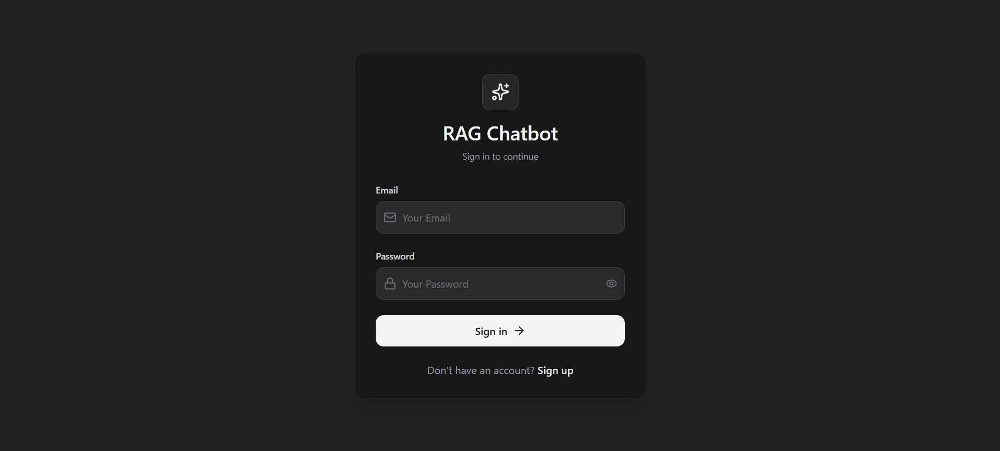
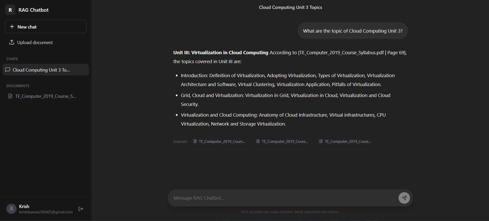
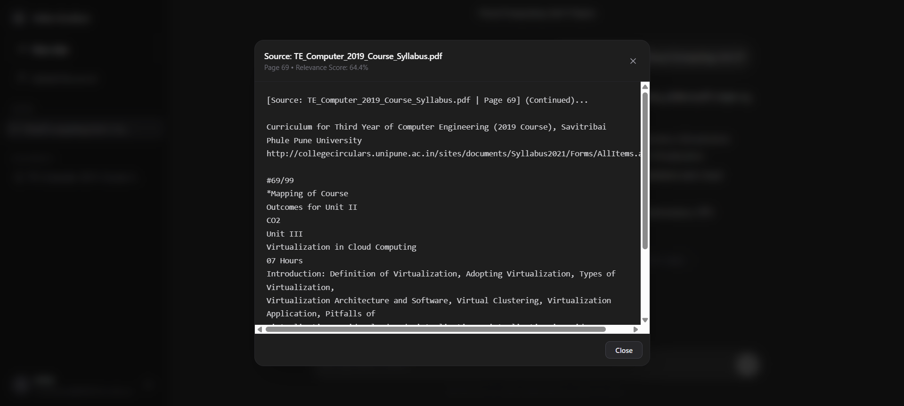
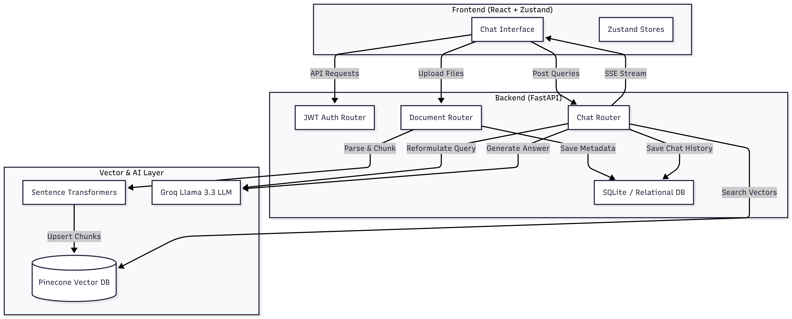

# Premium Full-Stack RAG Chatbot

A high-performance, full-stack **Retrieval-Augmented Generation (RAG)** Chatbot. The application enables users to upload textual documents (PDF, DOCX, TXT), parse them contextually on a page-by-page basis, index them into a high-dimensional vector space, and have interactive multi-turn conversations where responses are dynamically streamed and explicitly cited.

---

## 🚀 Key Features

* **Real-Time SSE Streaming**: True Server-Sent Events (SSE) token streaming via FastAPI's `StreamingResponse`, yielding instant Llama 3.3 responses with zero-typing simulator lag.
* **Contextual Query Reformulation**: Solves follow-up query context gaps by using Llama 3.3 to rewrite multi-turn search queries into standalone vectors based on conversational history.
* **Context-Preserving Page Chunking**: PDF parser scans page-by-page, prepending explicit source-filename and page-number metadata headers directly onto vector chunks to maintain structural boundaries.
* **Interactive Citations & Passage Modal**: Renders clean, deduplicated clickable citation badges (e.g., `syllabus.pdf (Pg. 15)`). Clicking a pill opens a glassmorphic modal displaying the exact raw context snippet retrieved from Pinecone with relevance scores.
* **Secure Sync Deletion**: Seamlessly deletes local document copies, removes SQL relational rows, and purges all corresponding vector chunks from Pinecone in real-time (`index.delete(filter={"document_id": id})`).
* **Multi-Tenant JWT Authentication**: Secure user registration, password hashing, and token-based guards. Documents and vector queries are strictly partitioned by `user_id`.
* **ChatGPT-Style UX**: Modern dark-mode layout with instant client-side new chat toggles, smooth scroll controls, hover action icons, and sidebar managers.

---

## 🛠️ Tech Stack

### Frontend
* **Core**: React (built with Vite)
* **Styling**: Tailwind CSS (sleek dark zinc aesthetic)
* **State Management**: **Zustand** (Modular stores for Auth, Chats, and Documents)
* **Icons & Markdown**: Lucide React, ReactMarkdown, Remark GFM, and Prism Syntax Highlighter.
* **API Ingestion**: Axios (with authorization interceptors) & Native Readable Fetch Streams.

### Backend
* **API Framework**: **FastAPI** (Uvicorn server)
* **Relational Database**: SQLAlchemy ORM (configured with SQLite/PostgreSQL)
* **Security**: Passlib (Bcrypt) & python-jose (JWT)
* **Text Extraction**: PyMuPDF (`fitz`), Python-Docx

### AI & Vector Services
* **Large Language Model**: **Llama 3.3 (70B)** via Groq API (Temperature `0.2` for factual accuracy)
* **Embeddings**: `SentenceTransformer` locally hosting the **`all-MiniLM-L6-v2`** model (384 dimensions)
* **Vector Index**: **Pinecone Vector Database** (Metadata filtered vector upserting and deletion)

---

## 📸 Application Screenshots

### Authentication

<p align="center">
  
</p>

---

### Chat Interface

<p align="center">
  
</p>

---

### Citation & Context Viewer

<p align="center">
  
</p>

---

## 📊 System Architecture Flow

<p align="center">
  
</p>

### Architecture Overview

The application follows a Retrieval-Augmented Generation (RAG) architecture where uploaded documents are parsed, chunked, embedded, and indexed in Pinecone. User queries undergo contextual reformulation before semantic retrieval, and the retrieved context is then supplied to Llama 3.3 for grounded response generation. Responses are streamed back to the client in real time using Server-Sent Events (SSE).

**Flow:**

1. User uploads PDF/DOCX/TXT documents.
2. Backend parses and chunks documents page-by-page.
3. Chunks are embedded using `all-MiniLM-L6-v2`.
4. Embeddings are indexed in Pinecone with metadata.
5. User submits a query through the React frontend.
6. Conversational context is reformulated into a standalone search query.
7. Pinecone retrieves the most relevant chunks.
8. Retrieved context is supplied to Llama 3.3 via Groq.
9. The generated response is streamed back to the frontend.
10. Citations are rendered from retrieved chunk metadata.

---

## 💻 Local Setup & Installation

### Prerequisites
* Python 3.10+ installed
* Node.js 18+ installed
* A Pinecone API Key
* A Groq Cloud API Key

---

### 1. Backend Setup

1. **Navigate to the Backend Directory**:
   ```bash
   cd backend
   ```

2. **Create and Activate a Virtual Environment**:
   ```bash
   python -m venv venv
   # On Windows:
   .\venv\Scripts\activate
   
   # On macOS/Linux:
   source venv/bin/activate
   ```

3. **Install Dependencies**:
   ```bash
   pip install -r requirements.txt
   ```

4. **Configure Environment Variables**:
   Create a `.env` file in the `backend` folder and populate it:
   ```env
   # Database Configurations
   DATABASE_URL=sqlite:///./sql_app.db
   SECRET_KEY=your_jwt_signature_secret_key
   ALGORITHM=HS256

   # Groq API Configuration
   GROQ_API_KEY=your_groq_cloud_api_key

   # Pinecone Vector Database Configurations
   PINECONE_API_KEY=your_pinecone_api_key
   PINECONE_INDEX_NAME=your_pinecone_index_name

   # Local Storage Directory
   STORAGE_BACKEND=local
   UPLOAD_DIR=uploads
   ```

5. **Initialize Relational Database Tables**:
   ```bash
   python -m app.db.init_db
   ```

6. **Start the FastAPI Server**:
   ```bash
   uvicorn app.main:app --reload
   ```
   The backend API will run at: `http://127.0.0.1:8000`

---

### 2. Frontend Setup

1. **Navigate to the Frontend Directory**:
   ```bash
   cd frontend
   ```

2. **Install Packages**:
   ```bash
   npm install
   ```

3. **Start the Development Server**:
   ```bash
   npm run dev
   ```
   The application will launch locally at: `http://localhost:5173`

---

## 📂 Project Directory Structure

```text
├── backend
│   ├── app
│   │   ├── api          # FastAPI route routers (auth, chat, documents)
│   │   ├── core         # Security models and configuration constants
│   │   ├── db           # Database engine setups and SQLAlchemy models
│   │   ├── models       # Database schema declarations (User, Document, Chat)
│   │   └── services     # Core RAG, chunking, parsing, and LLM services
│   ├── requirements.txt
│   └── uploads/         # Local file upload directory
│
├── frontend
│   ├── src
│   │   ├── components   # Reusable UI overlays and route guards
│   │   ├── layouts      # Layout wrappers
│   │   ├── pages        # Login, Register, and Chat pages
│   │   ├── services     # API Axios configurations
│   │   ├── store        # Zustand stores (authStore, chatStore, documentStore)
│   │   ├── App.jsx      # Navigation routing configurations
│   │   └── main.jsx
│   ├── package.json
│   └── vite.config.js
```

---

